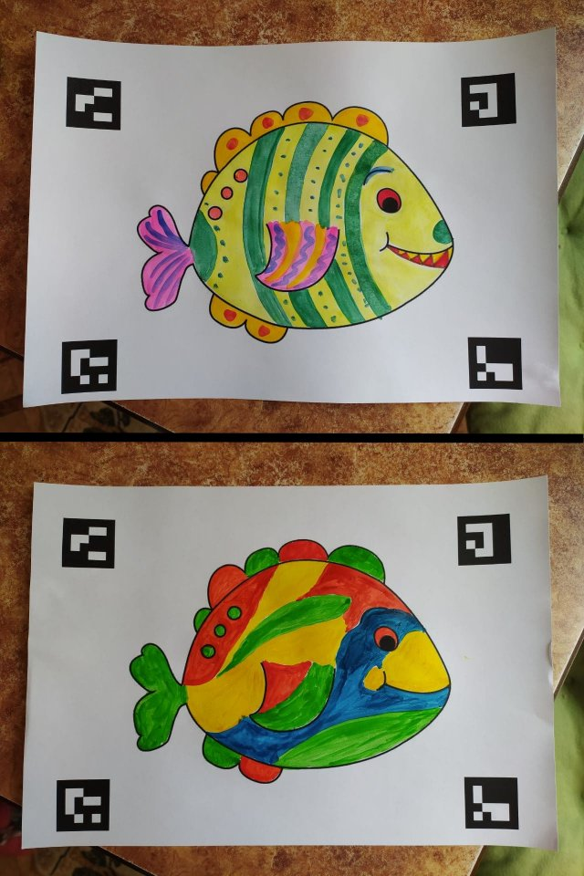
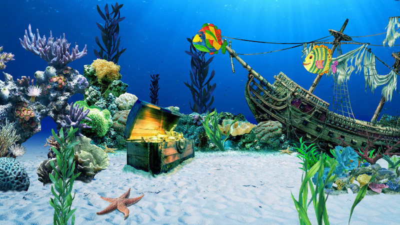

# FishScanner

[](https://www.youtube.com/watch?v=ClF8CrXzJ8k)

This is an open-source project inspired by this [video](https://www.youtube.com/watch?v=ILrr8vToR9Y&feature=emb_logo) from  Workinman Interactive LLC.

This repository allows you to build your own aquarium in which you can bring to life your drawings of fish.


### Dependencies and installation

Source code in this repository was tested with Python 3.7.9

You can find all the dependencies in the requirements.txt

To install this code, first create a virtual environment with Conda for example:
```sh
conda create -n FishScanner python=3.7
conda activate FishScanner
``` 

Then install all the requirements as:
```sh
pip install -r requirements.txt
``` 

### How to use

1) Print ./ocean/patterns/fish_1.pdf and decorate your fish:
    

2) Take a photo of your fish and put it in the ./photos folder

3) To run a demo run main_ocean.py:
    ```sh
    python main_ocean.py
    ``` 
    

### Project structure

All core code contains in the ./engine folder.

You can create your own aquarium using code example from the ./ocean folder.